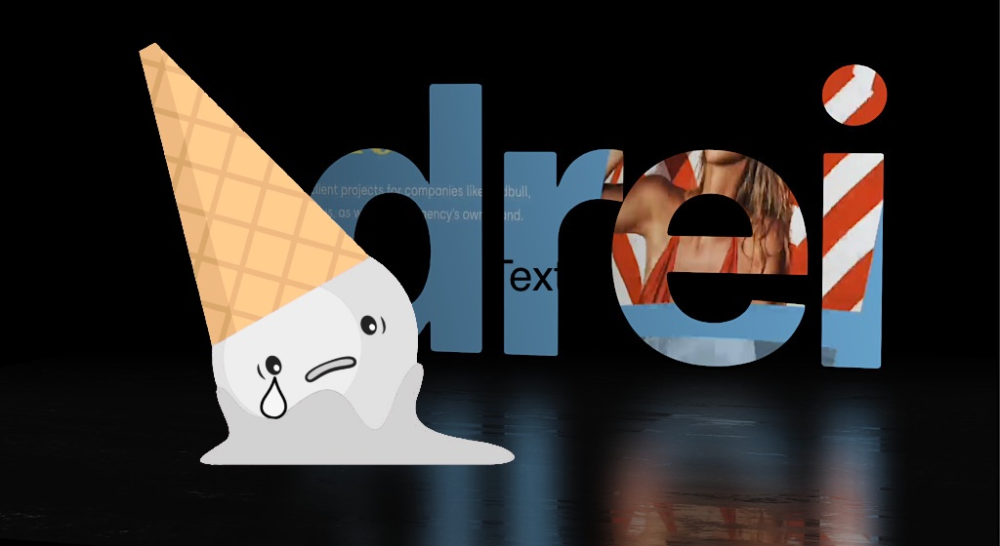

[](https://www.npmjs.com/package/@pmndrs/vanilla)
[](https://www.npmjs.com/package/@pmndrs/vanilla)
[](https://discord.gg/poimandres)
[](https://github.com/codespaces/new?template_repository=pmndrs%2Fdrei-vanilla)

A growing collection of useful helpers and fully functional, ready-made abstractions for Threejs. If you make a component that is generic enough to be useful to others, think about making it available here through a PR!

Storybook demos [](https://pmndrs.github.io/drei-vanilla/)

Storybook code available under [.storybook/stories](https://github.com/pmndrs/drei-vanilla/tree/main/.storybook/stories)

```bash
npm install @pmndrs/vanilla
```

### Basic usage:

```jsx
import { pcss, ... } from '@pmndrs/vanilla'
```

### Index

<table>
  <tr>
    <td valign="top">
      <ul>                
        <li><a href="#shaders">Shaders</a></li>
        <ul>
          <li><a href="#pcss">pcss</a></li>
        </ul>
      </ul>
    </td>    
  </tr>
  <tr>
    <td valign="top">
      <ul>                
        <li><a href="#materials">Materials</a></li>
          <ul>
            <li><a href="#meshreflectormaterial">MeshReflectorMaterial</a></li>
            <li><a href="#shadermaterial">shaderMaterial</a></li>
            <li><a href="#discardmaterial">MeshDiscardMaterial</a></li>
            <li><a href="#meshtransmissionmaterial">MeshTransmissionMaterial</a></li>
            <li><a href="#spotlight">SpotLight</a></li>
          </ul>
        <li><a href="#staging">Staging</a></li>
         <ul>
          <li><a href="#accumulativeshadows">AccumulativeShadows</a></li>
          <li><a href="#caustics">Caustics</a></li>
          <li><a href="#cloud">Cloud</a></li>
         </ul>
        <li><a href="#staging">Abstractions</a></li>
        <ul>
          <li><a href="#outlines">Outlines</a></li>
          <li><a href="#billboard">Billboard</a></li>
          <li><a href="#text">Text</a></li>
          <li><a href="#splat">Splat</a></li>
        </ul>
        <li><a href="#gizmos">Gizmos</a></li>
          <ul>
            <li><a href="#grid">Grid</a></li>
          </ul>
         <li><a href="#misc">Misc</a></li>
        <ul>
          <li><a href="#sprite-animator">Sprite Animator</a></li>
        </ul>
      </ul>
    </td>

  </tr>
</table>

# Shaders

#### pcss

[](https://pmndrs.github.io/drei-vanilla/?path=/story/shaders-pcss--pcss-story)

<p>
  <a href="https://codesandbox.io/s/ykfpwf"></a>
  <a href="https://codesandbox.io/s/dh2jc"></a>
</p>

```tsx
type SoftShadowsProps = {
  /** Size of the light source (the larger the softer the light), default: 25 */
  size?: number
  /** Number of samples (more samples less noise but more expensive), default: 10 */
  samples?: number
  /** Depth focus, use it to shift the focal point (where the shadow is the sharpest), default: 0 (the beginning) */
  focus?: number
}
```

Injects percent closer soft shadows (pcss) into threes shader chunk.

```javascript
// Inject pcss into the shader chunk
const reset = pcss({ size: 25, samples: 10, focus: 0 })
```

The function returns a reset function that can be used to remove the pcss from the shader chunk.

```javascript
// Remove pcss from the shader chunk, and reset the scene
reset(renderer, scene, camera)
```

# Materials

#### shaderMaterial

[](https://pmndrs.github.io/drei-vanilla/?path=/story/shaders-shadermaterial--shader-material-story)

<p>
  <a href="https://codesandbox.io/s/ni6v4"></a>
</p>

Creates a THREE.ShaderMaterial for you with easier handling of uniforms, which are automatically declared as setter/getters on the object and allowed as constructor arguments.

```jsx
const ColorShiftMaterial = shaderMaterial(
  { time: 0, color: new THREE.Color(0.2, 0.0, 0.1) },
  // vertex shader
  /*glsl*/ `
    varying vec2 vUv;
    void main() {
      vUv = uv;
      gl_Position = projectionMatrix * modelViewMatrix * vec4(position, 1.0);
    }
  `,
  // fragment shader
  /*glsl*/ `
    uniform float time;
    uniform vec3 color;
    varying vec2 vUv;
    void main() {
      gl_FragColor.rgba = vec4(0.5 + 0.3 * sin(vUv.yxx + time) + color, 1.0);
    }
  `
)

const mesh = new THREE.Mesh(geometry, new ColorShiftMaterial())
```

<details>
  <summary>TypeScript usage</summary>

Uniform types can be inferred from the `uniforms` argument or passed as a generic type argument.

```typescript
  type MyMaterialProps = {
    time: number,
    color: THREE.Color,
    map: THREE.Texture | null
  }

  const MyMaterial = shaderMaterial<MyMaterialProps>(
    {
      time: 0,
      color: new THREE.Color(0.2, 0.0, 0.1)
      map: null
    },
    vertexShader,
    fragmentShader
  )

  const material = new MyMaterial()
  material.time
        // ^? (property) time: number
```

</details>

#### MeshDiscardMaterial

A material that discards fragments. It can be used to render nothing efficiently, but still have a mesh in the scene graph that throws shadows and can be raycast.

```javascript
const mesh = new THREE.Mesh(geometry, new MeshDiscardMaterial())
```

#### MeshTransmissionMaterial

[](https://pmndrs.github.io/drei-vanilla/?path=/story/shaders-meshtransmissionmaterial--mtm-story)

<p>
  <a href="https://codesandbox.io/s/hmgdjq"></a>
</p>

An improved THREE.MeshPhysicalMaterial. It acts like a normal PhysicalMaterial in terms of transmission support, thickness, ior, roughness, etc., but has chromatic aberration, noise-based roughness blur, (primitive) anisotropicBlur support, and unlike the original it can "see" other transmissive or transparent objects which leads to improved visuals.

Although it should be faster than MPM keep in mind that it can still be expensive as it causes an additional render pass of the scene. Low samples and low resolution will make it faster. If you use roughness consider using a tiny resolution, for instance 32x32 pixels, it will still look good but perform much faster.

For performance and visual reasons the host mesh gets removed from the render-stack temporarily. If you have other objects that you don't want to see reflected in the material just add them to the parent mesh as children.

```typescript
export type MeshTransmissionMaterialProps = {
  /* Transmission, default: 1 */
  _transmission?: number
  /* Thickness (refraction), default: 0 */
  thickness?: number
  /* Roughness (blur), default: 0 */
  roughness?: number
  /* Chromatic aberration, default: 0.03 */
  chromaticAberration?: number
  /* AnisotropicBlur, default: 0.1 */
  anisotropicBlur?: number
  /* Distortion, default: 0 */
  distortion?: number
  /* Distortion scale, default: 0.5 */
  distortionScale: number
  /* Temporal distortion (speed of movement), default: 0.0 */
  temporalDistortion: number
}
```

```javascript
const material = new MeshTransmissionMaterial({
  _transmission: 1,
  thickness: 0,
  roughness: 0,
  chromaticAberration: 0.03,
  anisotropicBlur: 0.1,
  distortion: 0,
  distortionScale: 0.5,
  temporalDistortion: 0.0,
})
```

#### SpotLight

[](<[https://pmndrs.github.io/drei-vanilla/?path=/story/shaders-shadermaterial--shader-material-story](https://pmndrs.github.io/drei-vanilla/?path=/story/shaders-volumetricspotlight--volumetric-spotlight-story)>)

<p>
  <a href="https://codesandbox.io/s/tx1pq"></a>
  <a href="https://codesandbox.io/s/wdzv4"></a>
</p>

A Volumetric spotlight.

```javascript
const material = new SpotLightMaterial({
  opacity: 1, // volume shader opacity
  attenuation: 2.5, // how far the volume will travel
  anglePower: 12, // volume edge fade
  spotPosition: new Vector3(0, 0, 0), // spotlight's world position
  lightColor: new Color('white'), // volume color

  cameraNear: 0, // for depth
  cameraFar: 1, // for depth
  depth: null, // for depth , add depthTexture here
  resolution: new Vector2(0, 0), // for depth , set viewport/canvas resolution here
})
```

Optionally you can provide a depth-buffer which converts the spotlight into a soft particle.

#### MeshReflectorMaterial

[](https://pmndrs.github.io/drei-vanilla/?path=/story/shaders-meshreflectormaterial--mrm-story)

<p>
  <a href="https://codesandbox.io/s/lx2h8"></a>
  <a href="https://codesandbox.io/s/l900i"></a>
</p>

Easily add reflections and/or blur to any mesh. It takes surface roughness into account for a more realistic effect. This material extends from [THREE.MeshStandardMaterial](https://threejs.org/docs/#api/en/materials/MeshStandardMaterial) and accepts all its props.

###  AccumulativeShadows

[](https://pmndrs.github.io/drei-vanilla/?path=/story/shaders-accumulativeshadows--acc-shadow-story)

<p>
  <a href="https://codesandbox.io/s/hxcc1x"></a>
</p>

A planar, Y-up oriented shadow-catcher that can accumulate into soft shadows and has zero performance impact after all frames have accumulated. It can be temporal, it will accumulate over time, or instantaneous, which might be expensive depending on how many frames you render.

Refer to storybook code on how to use & what each variable does

#### Caustics

[](https://pmndrs.github.io/drei-vanilla/?path=/story/shaders-caustics--caustics-story)

[drei counterpart](https://github.com/pmndrs/drei#caustics)

Caustics are swirls of light that appear when light passes through transmissive surfaces. This component uses a raymarching technique to project caustics onto a catcher plane. It is based on [github/N8python/caustics](https://github.com/N8python/caustics).

```tsx
type CausticsProps =  {
  /** How many frames it will render, set it to Infinity for runtime, default: 1 */
  frames?: number
  /** Will display caustics only and skip the models, default: false */
  causticsOnly: boolean
  /** Will include back faces and enable the backsideIOR prop, default: false */
  backside: boolean
  /** The IOR refraction index, default: 1.1 */
  ior?: number
  /** The IOR refraction index for back faces (only available when backside is enabled), default: 1.1 */
  backsideIOR?: number
  /** The texel size, default: 0.3125 */
  worldRadius?: number
  /** Intensity of the projected caustics, default: 0.05 */
  intensity?: number
  /** Caustics color, default: THREE.Color('white') */
  color?: THREE.Color
  /** Buffer resolution, default: 2048 */
  resolution?: number
  /** Caustics camera position, it will point towards the contents bounds center, default: THREE.Vector3(5,5,5) */
  lightSource?: <THREE.Vector3>| <THREE.Object3D>
  /** Caustics camera far, when 0 its automatically computed in render loop, default: 0 .Use this if the auto computed value looks incorrect(Happens in very small models)*/
  far?: number
}
```

It will create a transparent plane that blends the caustics of the objects it receives into your scene. It will only render once and not take resources any longer!

Make sure to configure the props above as some can be micro fractional depending on the models (intensity, worldRadius, ior and backsideIOR especially).

The light source can either be defined by Vector3 or by an object3d. Use the latter if you want to control the light source, for instance in order to move or animate it. Runtime caustics with frames set to `Infinity`, a low resolution and no backside can be feasible.

```js
let caustics = Caustics(renderer, {
  frames: Infinity,
  resolution: 1024,
  worldRadius: 0.3,
  ...
})

scene.add(caustics.group) // add caustics group to your scene

caustics.scene.add(yourMesh) // add the mesh you want caustics from into the 'caustics scene'

// call the update() method in your animate loop for runtime (frames=Infinity case) else call it just once to compute the caustics
caustics.update()

// to see the camera helper
caustics.scene.add(caustics.helper)

```

Caustics function returns the following

```js
export type CausticsType = {
  scene: THREE.Scene // internal caustics scene
  group: THREE.Group // group for user to add into your scene
  helper: THREE.CameraHelper // helper to visualize the caustics camera
  params: CausticsProps // all properties from CausticsProps
  update: () => void // function to render the caustics output

  //internally used render targets
  normalTarget: THREE.WebGLRenderTarget
  normalTargetB: THREE.WebGLRenderTarget
  causticsTarget: THREE.WebGLRenderTarget
  causticsTargetB: THREE.WebGLRenderTarget
}
```

#### Cloud

[](https://pmndrs.github.io/drei-vanilla/?path=/story/staging-clouds--cloud-story)

[drei counterpart](https://github.com/pmndrs/drei#cloud)

Instanced Mesh/Particle based cloud.

```tsx
type CloudsProps = {
  /** cloud texture*/
  texture?: Texture | undefined
  /** Maximum number of segments, default: 200 (make this tight to save memory!) */
  limit?: number
  /** How many segments it renders, default: undefined (all) */
  range?: number
  /** Which material it will override, default: MeshLambertMaterial */
  material?: typeof Material
  /** Frustum culling, default: true */
  frustumCulled?: boolean
}
```

```ts
type CloudProps = {
  /** A seeded random will show the same cloud consistently, default: Math.random() */
  seed?: number
  /** How many segments or particles the cloud will have, default: 20 */
  segments?: number
  /** The box3 bounds of the cloud, default: [5, 1, 1] */
  bounds?: Vector3
  /** How to arrange segment volume inside the bounds, default: inside (cloud are smaller at the edges) */
  concentrate?: 'random' | 'inside' | 'outside'
  /** The general scale of the segments */
  scale?: Vector3
  /** The volume/thickness of the segments, default: 6 */
  volume?: number
  /** The smallest volume when distributing clouds, default: 0.25 */
  smallestVolume?: number
  /** An optional function that allows you to distribute points and volumes (overriding all settings), default: null
   *  Both point and volume are factors, point x/y/z can be between -1 and 1, volume between 0 and 1 */
  distribute?: ((cloud: CloudState, index: number) => { point: Vector3; volume?: number }) | null
  /** Growth factor for animated clouds (speed > 0), default: 4 */
  growth?: number
  /** Animation factor, default: 0 */
  speed?: number
  /** Camera distance until the segments will fade, default: 10 */
  fade?: number
  /** Opacity, default: 1 */
  opacity?: number
  /** Color, default: white */
  color?: Color
}
```

Usage

```jsx
// create main clouds group
clouds = new Clouds({ texture: cloudTexture })
scene.add(clouds)

// create cloud and add it to clouds group
cloud_0 = new Cloud()
clouds.add(cloud_0)
// call "cloud_0.updateCloud()" after changing any cloud parameter to see latest changes

// call in animate loop
clouds.update(camera, clock.getElapsedTime(), clock.getDelta())
```

#### Grid

[](https://pmndrs.github.io/drei-vanilla/?path=/story/gizmos-grid--grid-story)

[drei counterpart](https://github.com/pmndrs/drei#grid)

A y-up oriented, shader-based grid implementation.

```tsx
export type GridProps = {
  /** plane-geometry size, default: [1,1] */
  args?: Array<number>
  /** Cell size, default: 0.5 */
  cellSize?: number
  /** Cell thickness, default: 0.5 */
  cellThickness?: number
  /** Cell color, default: black */
  cellColor?: THREE.ColorRepresentation
  /** Section size, default: 1 */
  sectionSize?: number
  /** Section thickness, default: 1 */
  sectionThickness?: number
  /** Section color, default: #2080ff */
  sectionColor?: THREE.ColorRepresentation
  /** Follow camera, default: false */
  followCamera?: boolean
  /** Display the grid infinitely, default: false */
  infiniteGrid?: boolean
  /** Fade distance, default: 100 */
  fadeDistance?: number
  /** Fade strength, default: 1 */
  fadeStrength?: number
}
```

Usage

```jsx
grid = Grid({
  args: [10.5, 10.5],
  cellSize: 0.6,
  cellThickness: 1,
  cellColor: new THREE.Color('#6f6f6f'),
  sectionSize: 3.3,
  sectionThickness: 1.5,
  sectionColor: new THREE.Color('#9d4b4b'),
  fadeDistance: 25,
  fadeStrength: 1,
  followCamera: false,
  infiniteGrid: true,
})

scene.add(grid.mesh)

// call in animate loop
grid.update(camera)
```

Grid function returns the following

```jsx
export type GridType = {
  /* Mesh with gridMaterial to add to your scene  */
  mesh: THREE.Mesh
  /* Call in animate loop to update grid w.r.t camera */
  update: (camera: THREE.Camera) => void
}
```

#### Outlines

[](https://pmndrs.github.io/drei-vanilla/?path=/story/abstractions-outlines--outlines-story)

[drei counterpart](https://github.com/pmndrs/drei#outlines)

An ornamental component that extracts the geometry from its parent and displays an inverted-hull outline. Supported parents are `THREE.Mesh`, `THREE.SkinnedMesh` and `THREE.InstancedMesh`.

```tsx
export type OutlinesProps = {
  /** Outline color, default: black */
  color: THREE.Color
  /** Outline opacity, default: 1 */
  opacity: number
  /** Outline transparency, default: false */
  transparent: boolean
  /** Outline thickness, default 0.05 */
  thickness: number
  /** Geometry crease angle (0 === no crease), default: Math.PI */
  angle: number
}
```

Usage

```jsx
const outlines = Outlines()
const mesh = new THREE.Mesh(geometry, material)
mesh.add(outlines.group)

// must call generate() to create the outline mesh
outlines.generate()

scene.add(mesh)
```

Outlines function returns the following

```jsx
export type OutlinesType = {
  group: THREE.Group
  updateProps: (props: Partial<OutlinesProps>) => void
  generate: () => void
}
```

#### Billboard

[](https://pmndrs.github.io/drei-vanilla/?path=/story/abstractions-billboard--billboard-story)

[drei counterpart](https://github.com/pmndrs/drei#billboard)

Adds a `THREE.Group` that always faces the camera.

```tsx
export type BillboardProps = {
  /**
   * @default true
   */
  follow?: boolean
  /**
   * @default false
   */
  lockX?: boolean
  /**
   * @default false
   */
  lockY?: boolean
  /**
   * @default false
   */
  lockZ?: boolean
}
```

Usage

```js
const billboard = Billboard()
const mesh = new THREE.Mesh(geometry, material)
billboard.group.add(mesh)

scene.add(billboard)

// call in animate loop
billboard.update(camera)
```

Billboard function returns the following

```js
export type BillboardType = {
  group: THREE.Group
  /**
   * Should called every frame to update the billboard
   */
  update: (camera: THREE.Camera) => void
  updateProps: (newProps: Partial<BillboardProps>) => void
}
```

#### Text

[](https://pmndrs.github.io/drei-vanilla/?path=/story/abstractions-text--text-story)

[drei counterpart](https://github.com/pmndrs/drei#text)

Hi-quality text rendering w/ signed distance fields (SDF) and antialiasing, using [troika-3d-text](https://github.com/protectwise/troika/tree/master/packages/troika-3d-text). All of troikas props are valid!

> Required `troika-three-text` >= `0.46.4`

```ts
export type TextProps = {
  characters?: string
  color?: number | string
  // the text content
  text: string
  /** Font size, default: 1 */
  fontSize?: number
  maxWidth?: number
  lineHeight?: number
  letterSpacing?: number
  textAlign?: 'left' | 'right' | 'center' | 'justify'
  font?: string
  anchorX?: number | 'left' | 'center' | 'right'
  anchorY?: number | 'top' | 'top-baseline' | 'middle' | 'bottom-baseline' | 'bottom'
  clipRect?: [number, number, number, number]
  depthOffset?: number
  direction?: 'auto' | 'ltr' | 'rtl'
  overflowWrap?: 'normal' | 'break-word'
  whiteSpace?: 'normal' | 'overflowWrap' | 'nowrap'
  outlineWidth?: number | string
  outlineOffsetX?: number | string
  outlineOffsetY?: number | string
  outlineBlur?: number | string
  outlineColor?: number | string
  outlineOpacity?: number
  strokeWidth?: number | string
  strokeColor?: number | string
  strokeOpacity?: number
  fillOpacity?: number
  sdfGlyphSize?: number
  debugSDF?: boolean
  onSync?: (troika: any) => void
  onPreloadEnd?: () => void
}
```

Usage

```jsx
const text = Text({
  text: 'Hello World',
})
const mesh = new THREE.Mesh(geometry, material)
mesh.add(text.mesh)
```

Text function returns the following

```jsx
export type TextType = {
  mesh: THREE.Mesh
  updateProps: (newProps: Partial<TextProps>) => void
  dispose: () => void
}
```

You can preload the font and characters:

```ts
const preloadRelatedParams = {
  // support ttf/otf/woff(woff2 is not supported)
  font: '/your/font/path',
  characters: 'abcdefghijklmnopqrstuvwxyzABCDEFGHIJKLMNOPQRSTUVWXYZ1234567890!?.,:;\'"()[]{}<>|/@\\^$-%+=#_&~*',
  onPreloadEnd: () => {
    // this is the callback when font and characters are loaded
  },
```

#### Splat

[](https://pmndrs.github.io/drei-vanilla/?path=/story/abstractions-splat--splat-story)

[drei counterpart](https://github.com/pmndrs/drei#splat)

A declarative abstraction around [antimatter15/splat](https://github.com/antimatter15/splat). It supports re-use, multiple splats with correct depth sorting, splats can move and behave as a regular object3d's, supports alphahash & alphatest, and stream-loading.

```js
const loader = new SplatLoader(renderer)

const [shoeSplat, plushSplat, kitchenSplat] = await Promise.all([
  loader.loadAsync(`shoe.splat`),
  loader.loadAsync(`plush.splat`),
  loader.loadAsync(`kitchen.splat`),
])

const shoe1 = new Splat(shoeSplat, camera, { alphaTest: 0.1 })
shoe1.position.set(0, 1.6, 2)
scene.add(shoe1)

// This will re-use the same data, only one load, one parse, one worker, one buffer
const shoe2 = new Splat(shoeSplat, camera, { alphaTest: 0.1 })
scene.add(shoe2)

const plush = new Splat(plushSplat, camera, { alphaTest: 0.1 })
scene.add(plush)

const kitchen = new Splat(kitchenSplat, camera)
scene.add(kitchen)
```

In order to depth sort multiple splats correctly you can either use alphaTest, for instance with a low value. But keep in mind that this can show a slight outline under some viewing conditions.

You can also use alphaHash, but this can be slower and create some noise, you would typically get rid of the noise in postprocessing with a TAA pass. You don't have to use alphaHash on all splats.

```js
const plush = new Splat(plushSplat, camera, { alphaHash: true })
```

#### Sprite Animator

[](https://pmndrs.github.io/drei-vanilla/?path=/story/misc-spriteanimator--sprite-animator-story)

[drei counterpart](https://github.com/pmndrs/drei#sprite-animator)

```tsx
type SpriteAnimatorProps = {
  /** The start frame of the animation */
  startFrame?: number
  /** The end frame of the animation */
  endFrame?: number
  /** The desired frames per second of the animaiton */
  fps?: number
  /** The frame identifier to use, has to be one of animationNames */
  frameName?: string
  /** The URL of the texture JSON (if using JSON-Array or JSON-Hash) */
  textureDataURL?: string
  /** The URL of the texture image */
  textureImageURL?: string
  /** Whether or not the animation should loop */
  loop?: boolean
  /** The number of frames of the animation (required if using plain spritesheet without JSON) */
  numberOfFrames?: number
  /** Whether or not the animation should auto-start when all assets are loaded */
  autoPlay?: boolean
  /** The animation names of the spritesheet (if the spritesheet -with JSON- contains more animation sequences) */
  animationNames?: Array<string>
  /** Event callback when the animation starts */
  onStart?: Function
  /** Event callback when the animation ends */
  onEnd?: Function
  /** Event callback when the animation loops */
  onLoopEnd?: Function
  /** Event callback when each frame changes */
  onFrame?: Function
  /** Control when the animation runs */
  play?: boolean
  /** Control when the animation pauses */
  pause?: boolean
  /** Whether or not the Sprite should flip sides on the x-axis */
  flipX?: boolean
  /** Sets the alpha value to be used when running an alpha test. https://threejs.org/docs/#api/en/materials/Material.alphaTest */
  alphaTest?: number
  /** Displays the texture on a SpriteGeometry always facing the camera, if set to false, it renders on a PlaneGeometry */
  asSprite?: boolean
}
```

The SpriteAnimator is a powerful tool for animating sprites in a simple and efficient manner. It allows you to create sprite animations by cycling through a sequence of frames from a sprite sheet image or JSON data.

Notes:

- The SpriteAnimator uses `.update()` method added to requestAnimation frame loop to for efficient frame updates and rendering.
- The sprites should contain equal size frames
- Trimming of spritesheet frames is not yet supported

Usage

```js
const alienSpriteAnimator = SpriteAnimator({
  startFrame: 0,
  autoPlay: true,
  loop: true,
  numberOfFrames: 16,
  alphaTest: 0.01,
  textureImageURL: './sprites/alien.png',
})
await AlienSpriteAnimator.init() // file fetching happens here

alienSpriteAnimator.group.position.set(0, 0.5, 2)

scene.add(alienSpriteAnimator.group)
```

SpriteAnimator function returns the following object

```js
export type SpriteAnimatorType = {
  group: THREE.Group // A reference to the THREE.Group used for holding the sprite or plane.
  init: Function // Function to initialize, fetch the files and start the animations.
  update: Function // Function to update the sprite animation, needs to be called every frame.
  pauseAnimation: Function // Function to pause the animation.
  playAnimation: Function // Function to play the animation.
  setFrameName: Function // Function to set the frame identifier to use, has to be one of animationNames.
}
```
